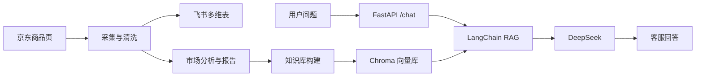

# 泡脚桶产品调研与本地 AI 客服 MVP

> 一个围绕“泡脚桶”类目搭建的 MVP 项目，包含电商市调与本地 AI 客服两条主线。

## 项目效果

当前版本已经可以完成：
- 京东泡脚桶真实商品小样本采集
- 飞书多维表自动写入
- 自动生成市场调研报告、汇报简版、仪表盘摘要
- 构建本地知识库
- 基于 LangChain + DeepSeek + Chroma 的本地客服机器人
- 本地 `/chat` 接口问答
- 多轮对话记忆

## 核心输出

### 1. 市场调研链路
- 从京东抓取泡脚桶商品数据
- 标准化商品字段，如标题、品牌、价格、链接、店铺名、图片等
- 自动写入飞书多维表
- 自动生成市场调研报告
- 自动生成汇报简版和仪表盘摘要数据
- 输出本地知识库，供客服机器人复用

### 2. AI 本地客服机器人
- 本地部署，基于 FastAPI 提供接口
- 使用 LangChain 组织 RAG 问答链路
- 使用 DeepSeek 作为大模型能力
- 使用 Chroma 做本地持久化向量库
- 支持多轮对话记忆
- 支持本地 `/chat` 直接提问

## 产出文件

运行 `python run_mvp.py` 后，会自动生成：
- `output/market_report.md`：市场调研报告
- `output/executive_brief.md`：一页式汇报简版
- `output/dashboard_summary.json`：仪表盘摘要数据
- `data/knowledge_base.json`：机器人本地知识库

## 项目架构图



## 技术栈
- Python 3.13
- FastAPI
- Playwright
- LangChain
- langchain-openai
- DeepSeek（通过 ChatOpenAI 兼容接入）
- Chroma
- 飞书多维表 API

## 目录结构
- `run_mvp.py`：市场调研主流程入口
- `app/collector/`：京东/天猫采集与清洗
- `app/sync/`：飞书多维表同步
- `app/analysis/`：统计分析与 AI 总结
- `app/report/`：市场报告、汇报简版、仪表盘摘要生成
- `app/bot/`：本地客服机器人、知识库、RAG 问答服务
- `config/keywords.json`：默认关键词配置
- `data/knowledge_base.json`：本地知识库数据
- `output/`：报告与摘要输出目录

## 环境准备
建议 Python 3.13。

```powershell
python -m pip install -r requirements.txt
python -m playwright install chromium
```

## 环境变量
项目通过 `.env` 读取配置。

### 飞书多维表
- `FEISHU_APP_ID`
- `FEISHU_APP_SECRET`
- `FEISHU_APP_TOKEN`
- `FEISHU_TABLE_PRODUCTS`
- `FEISHU_TABLE_JOBS`
- `FEISHU_USE_CN_FIELDS=1`

### 京东浏览器抓取
- `COLLECTOR_MODE=web`
- `COLLECTOR_PLATFORMS=jd`
- `COLLECTOR_PER_PLATFORM_LIMIT=20`
- `KEYWORDS_OVERRIDE=泡脚桶`
- `USE_BROWSER_COLLECTOR=1`
- `BROWSER_HEADLESS=0`
- `BROWSER_CDP_PORT=9222`

### DeepSeek / LangChain
- `OPENAI_API_KEY`
- `OPENAI_BASE_URL`
- `OPENAI_MODEL`
- `BOT_VECTOR_CACHE_PATH`

## 京东抓取前准备
```powershell
& "C:\Program Files\Google\Chrome\Application\chrome.exe" --remote-debugging-port=9222 --user-data-dir="D:\chrome-cdp-profile"
```

然后在该 Chrome 中：
1. 登录京东
2. 打开泡脚桶搜索页
3. 确认能看到商品列表

推荐页面：
[https://search.jd.com/Search?keyword=%E6%B3%A1%E8%84%9A%E6%A1%B6](https://search.jd.com/Search?keyword=%E6%B3%A1%E8%84%9A%E6%A1%B6)

## 运行市场调研
```powershell
python run_mvp.py
```

这一步会完成：
- 商品数据抓取
- 飞书多维表写入
- 报告与摘要生成
- 本地知识库刷新

## 启动本地 AI 客服机器人
```powershell
python -m uvicorn app.bot.server:app --host 127.0.0.1 --port 8001
```

健康检查：
```powershell
curl http://127.0.0.1:8001/health
```

## 本地问答接口
### `POST /chat`

```powershell
curl -Method POST http://127.0.0.1:8001/chat `
  -ContentType "application/json" `
  -Body '{"text":"泡脚桶怎么选？","session_id":"demo-001"}'
```

说明：
- `session_id` 可选
- 相同 `session_id` 会启用多轮对话记忆

### `POST /feishu/webhook`
```powershell
curl -Method POST http://127.0.0.1:8001/feishu/webhook `
  -ContentType "application/json" `
  -Body '{"token":"dev-token","event":{"text":"泡脚桶怎么选？"}}'
```

## 演示建议
1. 先启动带 `9222` 调试端口的 Chrome 并打开京东泡脚桶搜索页
2. 执行 `python run_mvp.py`
3. 打开飞书多维表查看商品数据
4. 打开 `output/market_report.md` 和 `output/executive_brief.md`
5. 启动本地机器人
6. 用 `/chat` 演示客服问答

## 当前已完成
- 京东泡脚桶商品采集
- 飞书多维表写入
- 市场调研报告生成
- 汇报简版生成
- 仪表盘摘要生成
- 本地知识库生成
- LangChain RAG 本地客服机器人
- Chroma 持久化向量检索
- `/chat` 本地问答接口
- 多轮对话记忆

## 已知限制
- 当前演示主线聚焦京东小样本
- 京东网页结构变化可能影响抓取稳定性
- 飞书字段读取权限仍可能受 Base 内部权限控制
- 当前更适合单机演示与 MVP 交付

## 后续可增强方向
1. 接入天猫真实抓取
2. 增强品牌、价格带、卖点交叉分析
3. 增加更完整的任务调度与监控
4. 增加更适合汇报的可视化页面

## License

本项目采用 [MIT License](./LICENSE)。
